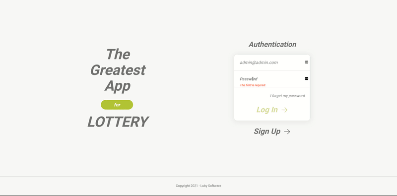

<p style="text-align:center">
	<h1>Lottery APP - The Greatest Lottery App</h1>
</p>
<p align="center">
	
</p>

<h4 align="center">
	🚧  Lottery APP - Concluído 🚀 🚧
</h4>

<p align="center">
 <a href="#-sobre">Sobre</a> •
 <a href="#-funcionalidades">Funcionalidades</a> •
 <a href="#-instalação">Instalação</a> •
 <a href="#-tecnologias">Tecnologias</a> •
 <a href="#-autor">Autor</a> •
 <a href="#-licença">Licença</a>
</p>


## 💻 Sobre

Esta é a versão web do projeto The Greatest Lottery App, a ideia é simular um ambiente de apostas. Nota: Esta aplicação foi feita apenas para realização de estudos.


Projeto desenvolvido durante o **Lab Luby** na [Luby Software](https://www.luby.com.br/) durante meu período de treinamento.
Foi utilizado o framework [ReactJS](https://reactjs.org/), visto que este tem uma grande comunidade criando diversas libs que auxiliam no desenvolvimento e um suporte com constante atualizações, o que torna este um dos frameworks mais populares para desenvolvimento de interfaces.

## 🎨 Layout

<p align="center">
  
</p>

## ⚙️ Funcionalidades

- [x] Cadastro de usuário
- [x] Recuperção de senha por email
- [x] Login através de [JWT](https://jwt.io/) token
- [x] Salvar múltiplas apostas no banco de dados
- [x] Filtrar suas apostas feitas
- [x] Carregar os tipos de aposta


## 🚀 Instalação

💡Execute primeiro o **[Backend](https://github.com/tgwow/lottery-api)** e depois execute este projeto.

### Pré-requisitos

Antes de começar, você vai precisar ter instalado em sua máquina as seguintes ferramentas:
[Git](https://git-scm.com), [Node.js](https://nodejs.org/en/) or [nvm](https://nodejs.org/en/download/package-manager/#nvm) this is a package manager to install/remove/switch differents versions of Node.js.

#### 🎲 Rodando (web)

```bash
# Clone esse repositorio
$ git clone https://github.com/tgwow/lottery-app.git
$ cd lottery-app
$ npm install
```
A aplicação inciará na porta:3000. Acesse http://localhost:3000 e começe a utilizar.


## 🛠 Tecnologias

As seguintes ferramentas foram usadas na construção do projeto:


#### [](https://github.com/tgwow/lottery-api)**Frontend**  [ReactJS](https://reactjs.org/)

-   **[Create-react-app](https://create-react-app.dev/docs/getting-started/)**
-   **[Redux](https://redux.js.org/)**
-   **[Redux Saga](https://redux-saga.js.org/)**
-   **[React-route-dom](https://reactrouter.com/web/guides/quick-start)**
-   **[Formik](https://formik.org/)**
-   **[Yup](https://github.com/jquense/yup)**
-   **[React Icons](https://react-icons.github.io/react-icons/)**


## 💪 Contribuindo

1. Faça um **fork** do projeto.
2. Crie uma nova branch com as suas alterações: `git checkout -b my-feature`
3. Salve as alterações e crie uma mensagem de commit contando o que você fez: `git commit -m "feature: My new feature"`
4. Envie as suas alterações: `git push origin my-feature`
> Caso tenha alguma dúvida confira este [guia de como contribuir no GitHub](./CONTRIBUTING.md)


## 🦸 Autor

<a href="https://www.linkedin.com/in/thiago-oliveira-86758738/">
 
 <br />
 <sub><b>Thiago Oliveira</b></sub></a> <a href="https://www.linkedin.com/in/thiago-oliveira-86758738/" title="Rocket">🚀</a>
 <br />

[](https://twitter.com/theveloper_tg) [](https://www.linkedin.com/in/thiago-oliveira-86758738/)


## 📝 Licença

Este projeto esta sobe a licença [MIT](./LICENSE).

Feito com ❤️ por Thiago Oliveira 👋🏽 [Entre em contato!](https://www.linkedin.com/in/thiago-oliveira-86758738/)
